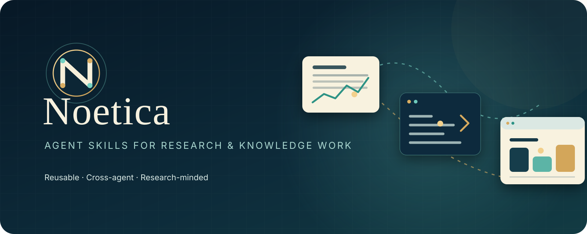
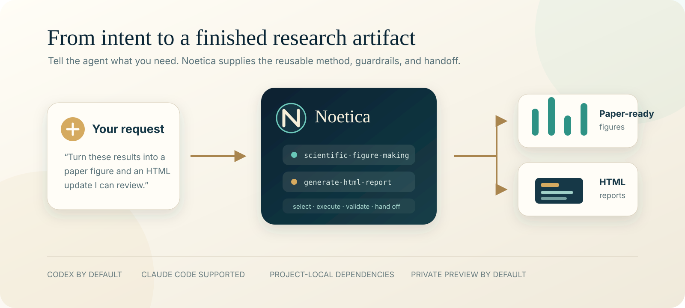

<p align="center">
  
</p>

<h1 align="center">Noetica</h1>

<p align="center">
  <strong>Agent skills and reusable workflows for research and knowledge work.</strong><br>
  把可靠的科研方法、汇报流程和工具使用方式，沉淀成 Codex 与 Claude Code 都能调用的 Skill。
</p>

<p align="center">
  <a href="https://github.com/JunhaoWu7/noetica-agent-skills/actions/workflows/validate.yml"></a>
  
  
  
</p>

## Noetica 是什么

Noetica 是一套会随着科研生涯持续生长的个人 Agent Skill 库。你只需要用大白话告诉 Agent 想完成什么，匹配的 Skill 会提供可复用的方法、执行步骤、安全边界和交付标准。

它不是一个只能完成单项任务的“大 Skill”，而是一组可以独立使用、也能自由串联的模块：

- **少记命令**：描述目标即可，不必背脚本参数或固定提示词。
- **跨 Agent**：默认安装到 Codex，同时支持 Claude Code。
- **重视结果**：每个流程都包含验证、可复现性和交付检查。
- **默认克制**：依赖装在项目环境，预览只监听本机，不擅自公开科研材料。

## 30 秒开始

```bash
git clone https://github.com/JunhaoWu7/noetica-agent-skills.git
cd noetica-agent-skills
./install.sh
```

默认只安装到 Codex。安装后重新打开 Agent 会话，然后直接说：

```text
把这些实验结果做成论文里的对比图，同时输出 PDF 和 PNG。
把本周进展、反馈和图表整理成一个 HTML 展示。
在服务器上把这个报告安全地跑起来，我要从本地浏览器看。
```

## Skill 目录

| Skill | 适合什么时候用 | 主要结果 |
|---|---|---|
| [`generate-html-report`](skills/generate-html-report/SKILL.md) | HTML 展示、进展汇报、反馈分析、项目复盘 | 响应式静态报告、指标卡、表格与图文页面 |
| [`scientific-figure-making`](skills/scientific-figure-making/SKILL.md) | 论文绘图、消融实验、趋势与置信区间、多面板排版 | PDF、SVG 和高分辨率 PNG |
| [`serve-web-over-ssh`](skills/serve-web-over-ssh/SKILL.md) | 在远程服务器私密预览报告或 Web UI | 持久服务、状态管理与 SSH 转发命令 |

<p align="center">
  
</p>

这些 Skill 可以独立调用，也可以组成一条完整链路：

```text
研究材料 → 分析 / scientific-figure-making → generate-html-report → public/
                                                                  ↓
                                                        serve-web-over-ssh
                                                                  ↓
                                                           本地浏览器查看
```

## 安装方式

```bash
./install.sh           # 默认：仅 Codex
./install.sh codex     # 明确指定仅 Codex
./install.sh claude    # 仅 Claude Code
./install.sh all       # Codex + Claude Code
```

默认位置：

- Codex：`${CODEX_HOME:-$HOME/.codex}/skills/`
- Claude Code：`${CLAUDE_CONFIG_DIR:-$HOME/.claude}/skills/`

安装器使用符号链接，不会复制出多份难以同步的 Skill。`git pull` 后，已安装内容会立即指向最新版；新增 Skill 或首次安装到另一种 Agent 时，再运行一次对应安装命令。

安装器会保护已有文件：如果目标位置是普通文件、目录或其他项目的链接，它会保留原内容并停止，不会强行覆盖。

## 使用示例

### 论文级绘图

```text
把 results.csv 做成论文里的多方法对比柱状图，同时输出 PDF 和 PNG。
根据这组训练结果画两栏趋势图，带置信区间，适合论文双栏排版。
参考 figures4papers 的风格重做这张消融实验图，但不要改变数据含义。
```

`scientific-figure-making` 会先检查数据和绘图环境，再选择适当版式、配色与导出格式。Python 包只安装到实际研究项目已有的环境或项目本地 `.venv`，不会修改系统全局 Python。

### HTML 展示与汇报

```text
把这些材料做成 HTML 展示，结论放前面。
把 feedback.csv 做成反馈分析页面。
把本周实验进展、图表和问题整理成组会汇报页面。
```

`generate-html-report` 会优先复用当前项目的报告链路；项目没有现成链路时，再用自带模板初始化报告中心，生成 Markdown 源文件和静态 HTML，并运行构建与测试。

### SSH 私密预览

Agent 通常会代你完成启动与检查。需要手动管理时：

```bash
./skills/serve-web-over-ssh/scripts/web-session \
  start-static my-report /path/to/report auto

./skills/serve-web-over-ssh/scripts/web-session list
./skills/serve-web-over-ssh/scripts/web-session status my-report
./skills/serve-web-over-ssh/scripts/web-session logs my-report 100
./skills/serve-web-over-ssh/scripts/web-session stop my-report
```

服务只绑定远端 `127.0.0.1`，工具会返回端口和本地 SSH 转发命令。不要把仓库根目录、Home、凭证目录、原始训练数据或私有会话目录作为网页根目录。

## 更新

```bash
git pull --ff-only
./install.sh
```

如果你同时安装给 Codex 和 Claude Code，使用 `./install.sh all` 重新发现新增 Skill。

## 仓库架构

```text
.
├── skills/
│   ├── generate-html-report/
│   ├── scientific-figure-making/
│   └── serve-web-over-ssh/
├── docs/images/                    # Noetica 品牌与工作流图片
├── scripts/validate-skills.py      # 全仓库 Skill 校验
├── tests/test-install.sh           # 双平台安装与冲突保护测试
├── install.sh                      # 自动发现并注册全部 Skill
├── CLAUDE.md                       # 仓库维护约定
└── AGENTS.md -> CLAUDE.md          # Claude Code / Codex 共用约定
```

新增 Skill 时，把它放在 `skills/<skill-name>/` 并重新运行安装器，不需要手工维护安装列表。

## 依赖与安全边界

- 所有 Skill：Bash、Python 3。
- 科研绘图：按需使用 `matplotlib`、`numpy`，必要时增加 `scipy`、`seaborn`、`python-dateutil` 或 `pandas`。
- SSH 安全预览：`tmux`、`ss`（通常由 `iproute2` 提供）。
- 安装器不会安装系统软件、修改防火墙、公开端口或下载无关案例仓库。
- 若操作需要 `sudo`、系统包、替换冲突锁文件或强制升级依赖，Agent 应停止并说明原因。
- 不要提交 API Key、未发表研究数据、私有论文、数据集、模型权重或生成研究产物。

## 添加或维护 Skill

```bash
make test
bash -n install.sh tests/test-install.sh
git diff --check
```

每个 Skill 都应遵循以下原则：

1. 名称只使用小写字母、数字和连字符，目录名与 `SKILL.md` 的 `name` 一致。
2. `SKILL.md` 只保留核心流程；详细规范放 `references/`，确定性操作放 `scripts/`，模板放 `assets/`。
3. 核心说明保持平台中立；`agents/openai.yaml` 可以增强 Codex 界面，但不能成为 Claude Code 使用 Skill 的前提。
4. 新增或修改后运行全仓库测试，并确认 README 与实际行为一致。

## 来源说明

`scientific-figure-making` 的方法规范经作者许可，从 [`figures4papers`](https://github.com/ChenLiu-1996/figures4papers) 的提交 `6790a93` 集成。本仓库保留了来源与修改范围说明，没有复制其 `figure_*` 案例脚本、图片或生成结果，也不会在安装时下载案例库。详情见 [`source.md`](skills/scientific-figure-making/references/source.md)。
